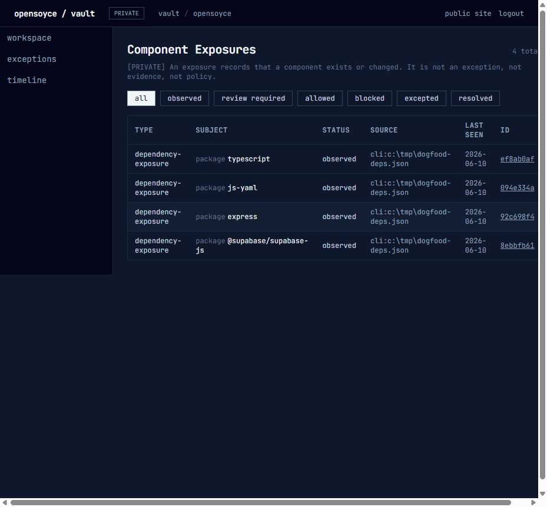
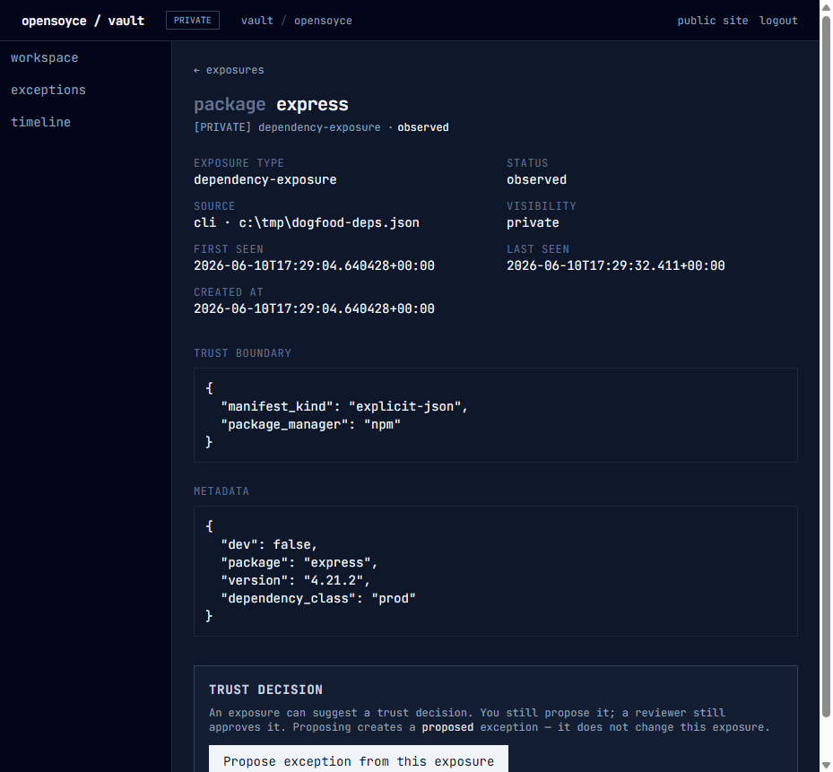
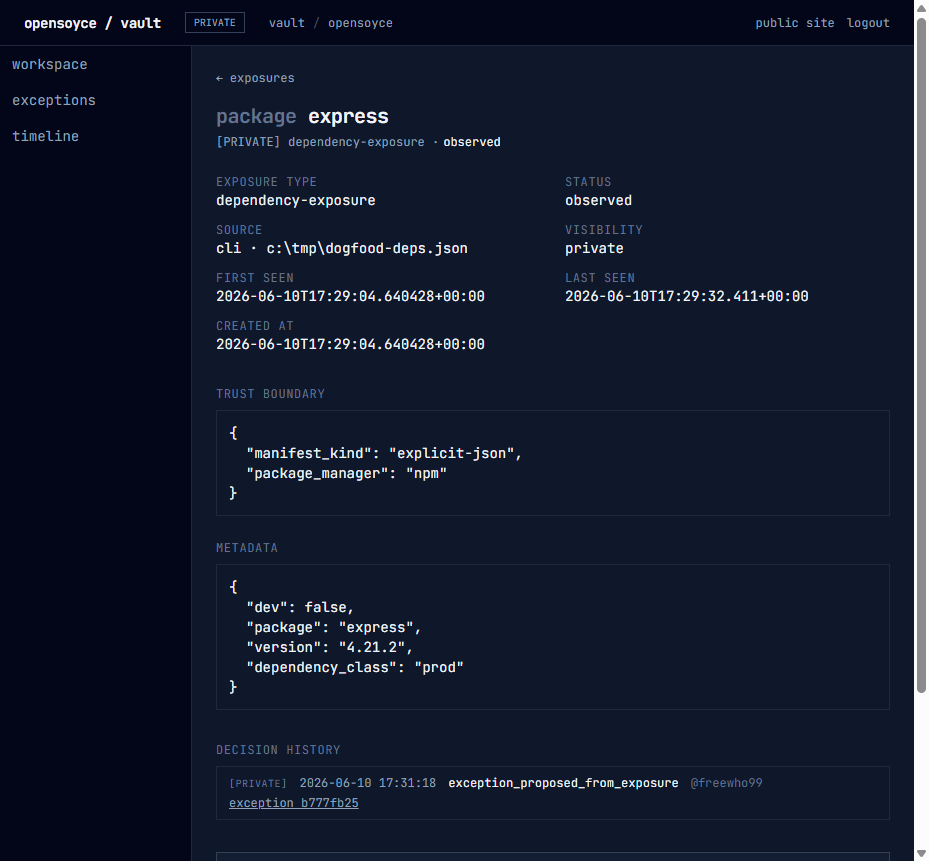
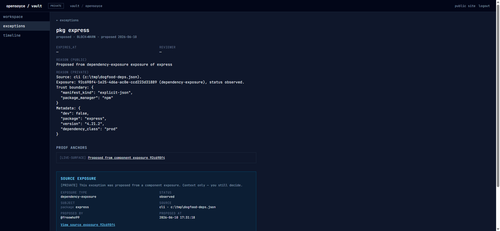
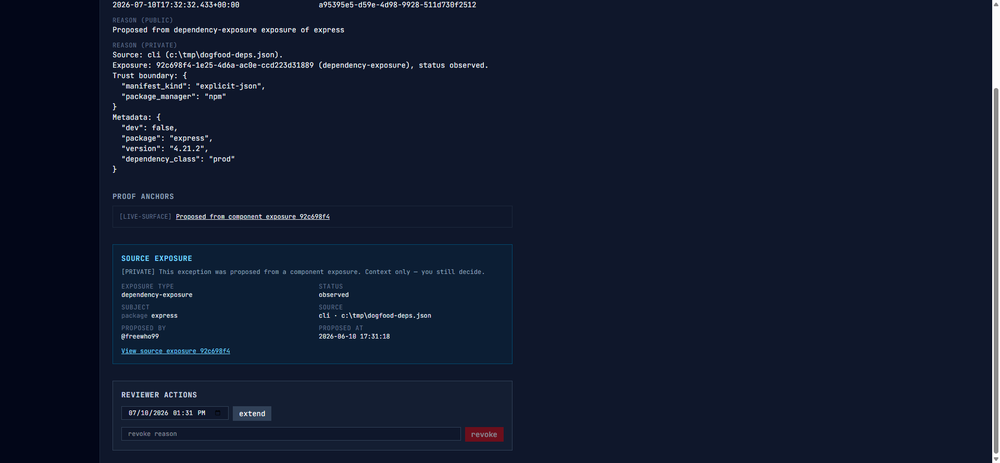
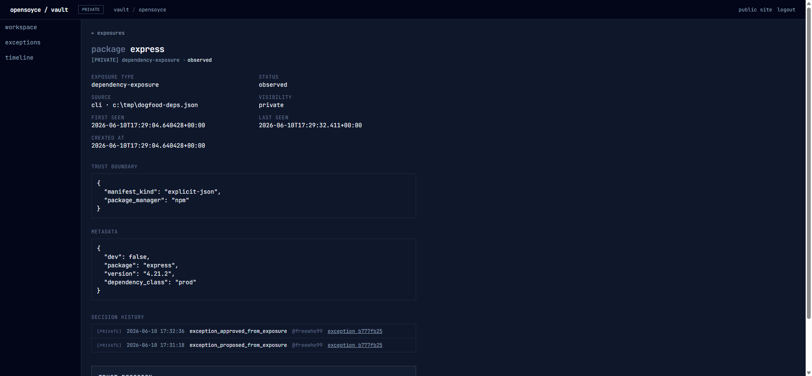
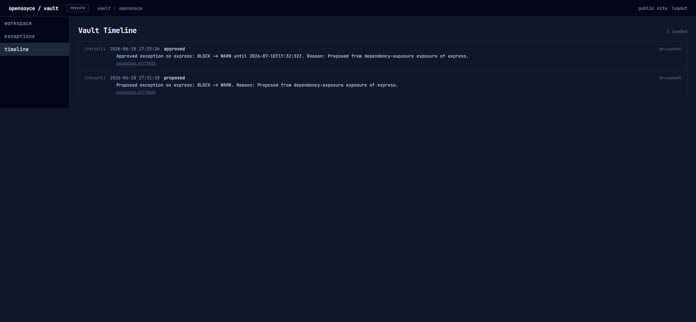

# Production CEI Decision Loop Proof

From dependency observation to reviewed trust decision, with receipts.

## What this is

This is a proof artifact, not a marketing claim.

On 2026-06-10, the full CEI decision loop ran against live production at `www.opensoyce.com` — real GitHub login, real workspace, real CLI session, real database writes, real reviewer decision, real receipts. Every screenshot below is the production UI during that run. Nothing here is a mockup, a local dev server, or a test fixture.

The thesis it proves:

> OpenSoyce turns software supply-chain noise into provable trust decisions.

What it does NOT claim: SOC 2 or any compliance support remains future work and is not claimed here. No remediation, no automation, no scanner intelligence — the loop below is observation, human proposal, human review, and receipts. That is the point.

## Doctrine

```txt
Observation is not judgment.
Repetition is not new evidence.
Provenance must not be erased.
A record is not real until production can produce it.
```

## The run

| | |
|---|---|
| Date | 2026-06-10, ~17:26–17:34 UTC |
| Target | production (`www.opensoyce.com`) |
| Actor | `@freewho99` (workspace owner) |
| Workspace | `opensoyce` — created during the run by the atomic workspace+owner function |
| Input | a four-package explicit dependency file (below) |

```json
{
  "dependencies": [
    { "name": "express", "version": "4.21.2" },
    { "name": "@supabase/supabase-js", "version": "2.106.0" },
    { "name": "js-yaml", "version": "4.1.1" },
    { "name": "typescript", "version": "5.6.3", "dev": true }
  ]
}
```

---

## 1 — Observation

GitHub login at `/vault` worked. The workspace resolved. CLI device-code login worked (`opensoyce login` → browser approval → session). Then:

```txt
opensoyce exposure ingest-dependencies --workspace opensoyce --file deps.json --dry-run
opensoyce exposure ingest-dependencies --workspace opensoyce --file deps.json
```

Four dependency-exposure records landed in production:



The exposure detail shows exactly what an observation is — and what it is not:



The page says it itself: *an exposure records that a component exists or changed. It is not an exception, not evidence, not policy.* There is no approve button on an observation. There never will be.

## 2 — Repetition, deduped (7C in production)

The same dependency facts were ingested repeatedly — same file again, then the same facts from a different file path. Twelve total ingest attempts. The production table after all of them:

```txt
total rows: 4   (not 12)

each row:
  seen_count:         2
  first source_ref:   the ORIGINAL file        (preserved)
  latest_source_ref:  the second sighting      (updated)
  status:             observed                 (untouched)
```

One stable exposure fact. Repeat-observation metadata. Latest and bounded provenance. The first sighting is still historically understandable; the repeat sighting still mattered; no duplicate primary rows polluted the record.

Repetition is not new evidence. Provenance must not be erased.

## 3 — Proposal

A human proposed an exception from the `express` exposure — two-step review, then submit. The exposure was not mutated; a `proposed` exception was created, carrying a live-surface proof anchor pointing back at the exposure:



The moment the proposal existed, CEI recorded the relationship in its own audit surface: `exception_proposed_from_exposure`, by whom, at what time, linking the exception.

## 4 — Reviewer context (6E in production)

The reviewer evaluating the proposed exception sees where it came from, without leaving the page:



The card says it out loud: *Context only — you still decide.* The exposure suggested. The card informed. Nothing auto-decided.

## 5 — Decision

The reviewer approved: `BLOCK → WARN`, with a thirty-day expiry, reviewer recorded. The exception state machine — the Phase 5 machine, unchanged by everything built on top of it — executed in production:



## 6 — Receipts

Back on the exposure, the Decision history now tells the whole story, newest first:

```txt
exception_approved_from_exposure   17:32:36   @freewho99
exception_proposed_from_exposure   17:31:18   @freewho99
```



Note the exposure status: still `observed`. The decision lived its whole life in the exception; CEI recorded the relationship; the observation was never judged into something else.

And independently — written by database triggers, not by any of the surfaces above — the Vault Timeline recorded its own Phase 5 receipts:



Two audit surfaces, two mechanisms, one story. Production preserved the full decision trail.

## The loop, complete

```txt
dependency observed                (CLI ingestion, source_kind: cli)
→ repeated noise deduped           (seen_count: 2, four rows, provenance intact)
→ exception proposed               (human, two-step, proposed-only)
→ reviewer saw source context      (context only — you still decide)
→ reviewer decided                 (BLOCK → WARN, active, expires, recorded)
→ receipts preserved               (CEI events + Vault Timeline, independently)
```

## What shipped to make this possible

| PR | SHA | What it locked |
|---|---|---|
| 6F reviewer-outcome audit | #98 / `da986f4` | CEI records the decision back to the exposure |
| Phase 6 closeout | #99 / `578ee18` | the decision loop, bottled |
| 7A local CLI ingestion | #100 / `1b3b30b` | observations enter from outside the dashboard |
| 7B CI attribution | #101 / `107d941` | observations attribute the run that saw them |
| 7C semantic dedupe | #102 / `7928c9f` | repetition is quiet; provenance is not erased |
| 7D GitHub Action wrapper | #103 / `66f9029` | packaging makes observation repeatable |
| Post-7C strategy doctrine | #104 / `c0c0394` | the forward map |
| PR-RUNTIME-1 | #105 / `bc24bb1` | the runtime deployed where users run it |
| PR-INTEGRITY-1 | #106 / `3da3cf0` | schema, runtime, and config presence guarded |

## Honest edges

- The proposer and the reviewer were the same person, acting as workspace **owner** — the four-eye rule's owner exception, appropriate for a single-user dogfood. In a multi-member workspace a `reviewer` cannot approve their own proposal.
- The approved exception will sit `active` past its expiry until the lifecycle/reaper lane ships — this run is the first live evidence of that pressure, not a surprise.
- The CLI's text output said "created" for the absorbed repeat sightings; its JSON output and the database were accurate. CLI seen-again reporting is queued behind its own scope.
- Workspace creation in v0 is API-only; the run created it with an authenticated call, not a dashboard button.

These edges are listed because the credibility engine is the honesty doctrine: the product says which is which.
