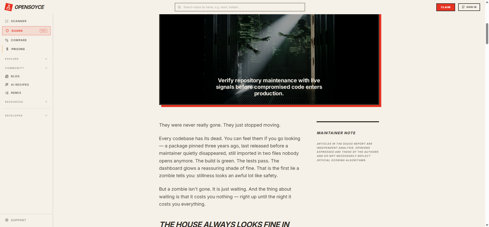
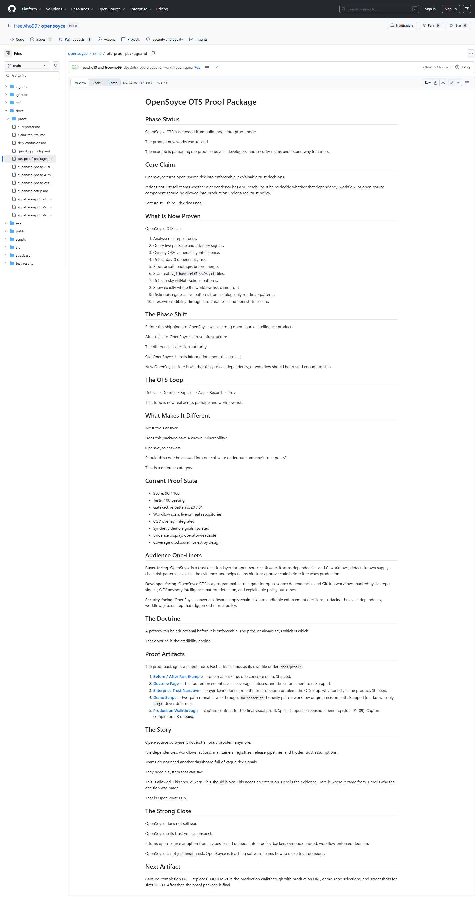
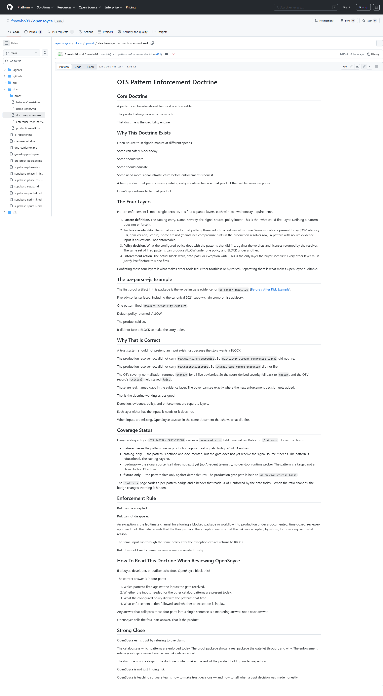
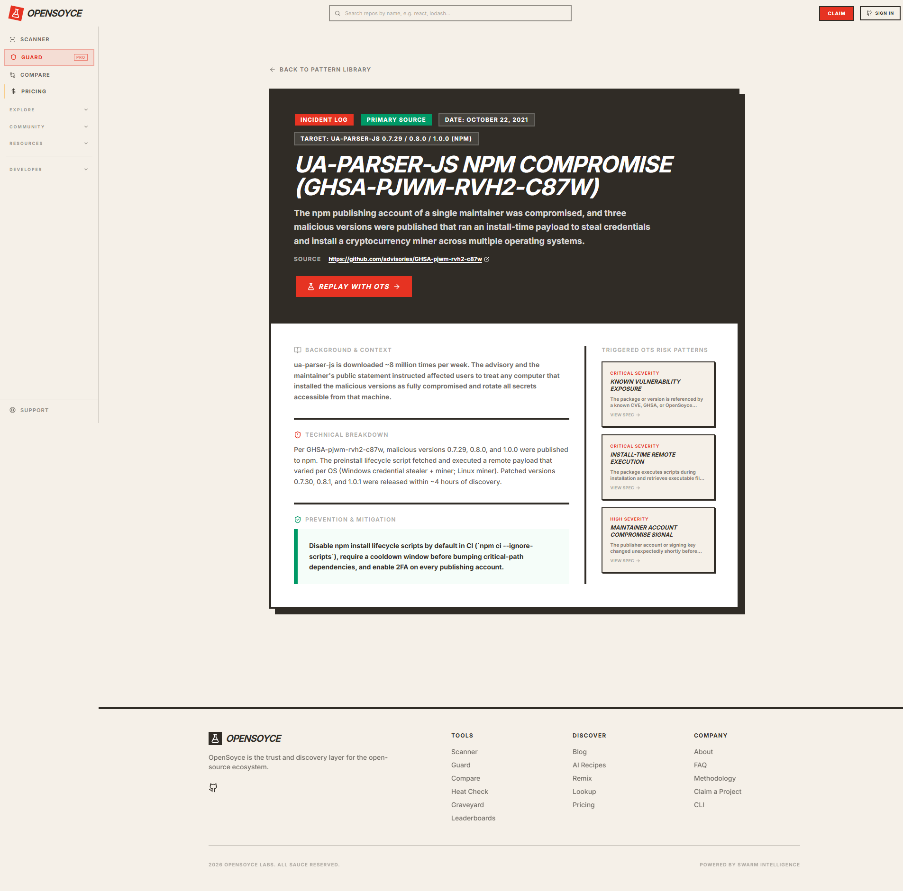
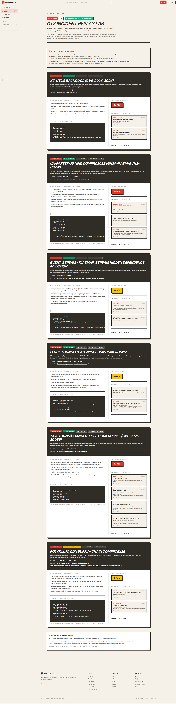
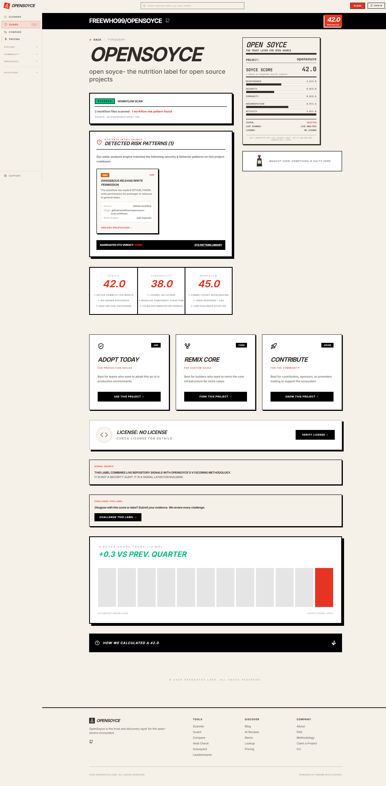
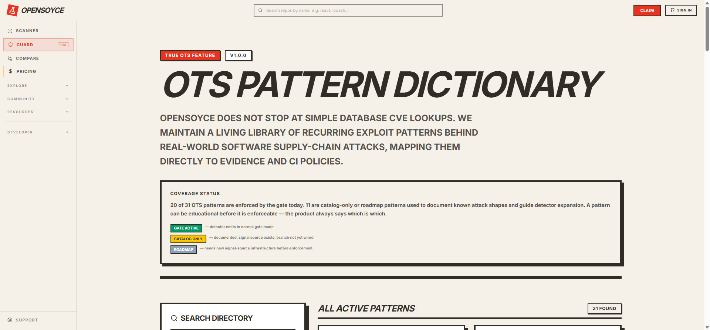
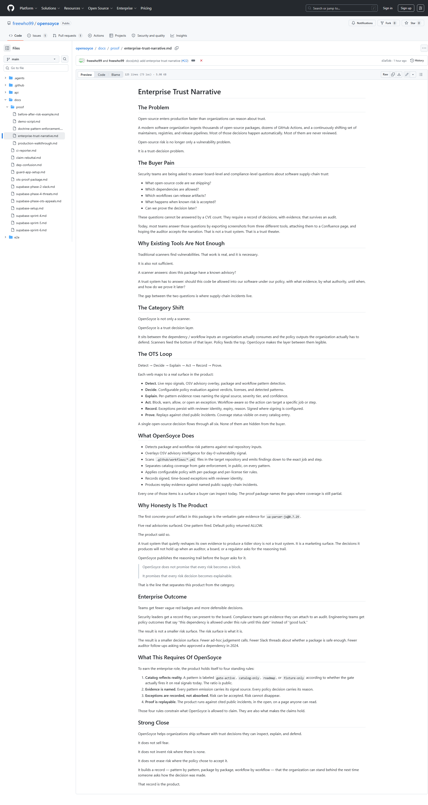
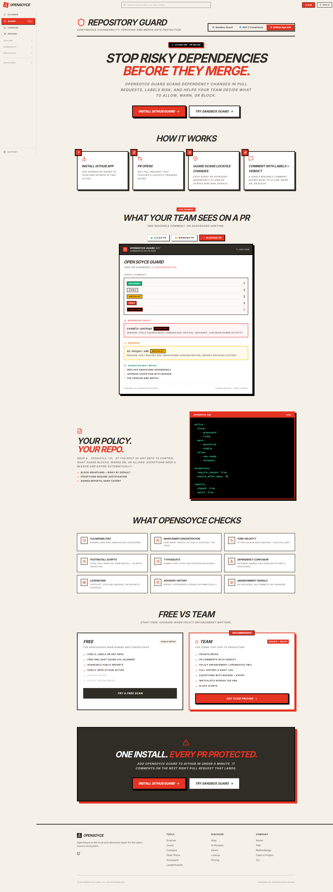

# Production Walkthrough

## Status

This walkthrough is the final proof-package artifact.

Captures completed: 2026-06-01 against `opensoyce-f336.vercel.app`. Nine numbered slots filled. One GUARD probe documented. One spine assumption (deployed UI exposes only a GitHub owner/repo scanner) revised by the captures — see Step 4.

## Purpose

This artifact turns the runnable demo script into visual proof.

The [demo script](demo-script.md) tells a presenter what to do.

The production walkthrough shows what actually happened on the deployed product.

Without screenshots, the proof package ends at "here is what would happen." With them, it ends at "here is what did happen, on this URL, on this date, against this repo."

## Capture Requirements

This document captures the following nine artifacts against the live deployment. Each maps to a slot in the inventory table below.

1. Production URL loaded.
2. Proof package page visible.
3. Doctrine page visible (four-layer model).
4. `ua-parser-js` production surface — the deployed `/incidents/ua-parser-js-compromise` case study **and** the live-replay output on `/proof/ots-replays`, linked back to the verbatim `ua-parser-js@0.7.29` gate evidence in the repo docs.
5. Project Detail page with workflow scan summary.
6. Workflow-originated pattern card.
7. Pattern card evidence rows showing:
   - `Source: GitHub workflow`
   - exact `Origin`
8. `/patterns` page showing gate-active coverage count.
9. Enterprise narrative close.

Plus one probe captured separately, outside the numbered sequence:

- **GUARD** — probed and confirmed **public**. Marketing surface, sandbox interactions, and sample PR-comment renderer all load without auth. The PRO label refers to a TEAM-tier feature ladder (private repos, `.opensoyce.yml` policy enforcement, audit log, etc.), not auth-gated surface access.

## Screenshot Inventory

| Slot | Screenshot | Required proof |
| --- | --- | --- |
| 01 | [01-production-homepage.png](images/01-production-homepage.png) | Production URL loaded |
| 02 | [02-proof-package-index.png](images/02-proof-package-index.png) | Proof package index visible |
| 03 | [03-doctrine-four-layer-model.png](images/03-doctrine-four-layer-model.png) | Doctrine four-layer model visible |
| 04a | [04a-ua-parser-js-incident-page.png](images/04a-ua-parser-js-incident-page.png) | `/incidents/ua-parser-js-compromise` case study + triggered patterns |
| 04b | [04b-ua-parser-js-replay-lab.png](images/04b-ua-parser-js-replay-lab.png) | `/proof/ots-replays` live-detector output for ua-parser-js (3 patterns, BLOCK) |
| 05/06/07 | [05-06-07-workflow-scan-and-pattern.png](images/05-06-07-workflow-scan-and-pattern.png) | Project Detail page for `freewho99/opensoyce`: workflow scan summary + pattern card + `Source: GitHub workflow` + exact `Origin` |
| 08 | [08-patterns-coverage.png](images/08-patterns-coverage.png) | `/patterns` coverage status (20/31 gate-active) + doctrine sentence rendered in production |
| 09 | [09-enterprise-close.png](images/09-enterprise-close.png) | Enterprise narrative key line + Strong Close |
| G | [G-guard-public.png](images/G-guard-public.png) | GUARD probe result — **public** marketing/sandbox surface, with PRO/TEAM feature tier |

## Walkthrough

### Step 1 — Open Production

URL: `https://opensoyce-f336.vercel.app/`

What this proves: the deployed product loads at a public URL with no auth wall. The phase shift from build mode to proof mode has a public address.

Observed: homepage renders the trust-layer hero ("BEFORE YOU BUILD ON OPEN SOURCE, CHECK THE LABEL."), the sidebar navigation (SCANNER, GUARD PRO, COMPARE, PRICING, EXPLORE/COMMUNITY/RESOURCES/DEVELOPER), the sample SOYCE-label card, and the AI-dependency leaderboard preview. No sign-in required.

### Step 2 — Open Proof Package

URL: `https://github.com/freewho99/opensoyce/blob/main/docs/ots-proof-package.md`

What this proves: the product has a parent proof artifact and a visible artifact index. Every claim made downstream can be traced back to this index.

Observed: GitHub-rendered parent doc shows Phase Status, Core Claim, What Is Now Proven, The Phase Shift, The OTS Loop, Current Proof State (score 90/100, tests 100 passing, 20/31 gate-active), the doctrine, and the Proof Artifacts index linking to all five children. The proof package lives in the repo today; surfacing it in the deployed product is a separate engineering decision (see Remaining Work).

### Step 3 — Show Doctrine

URL: `https://github.com/freewho99/opensoyce/blob/main/docs/proof/doctrine-pattern-enforcement.md`

What this proves: the product publicly separates detection, evidence, policy, and enforcement. The four-layer model is on the page, not buried in a slide deck.

Observed: doctrine page renders Core Doctrine, Why This Doctrine Exists, The Four Layers (pattern definition / evidence availability / policy decision / enforcement action), the ua-parser-js example, Why That Is Correct (naming the three evidence-layer gaps), Coverage Status (`gate-active` / `catalog-only` / `roadmap` / `fixture-only`), and the Enforcement Rule ("Risk can be accepted. Risk cannot disappear."). The coverage sentence ("a pattern can be educational before it is enforceable") also renders in the deployed `/patterns` page — see slot 08.

### Step 4 — Show the `ua-parser-js` Production Surfaces and the Seam

The deployed product has two public `ua-parser-js` surfaces. The walkthrough captures both, then links to the third (repo-doc) surface that closes the seam.

**Surface 4a — Incident case study.** URL: `https://opensoyce-f336.vercel.app/incidents/ua-parser-js-compromise`

What this proves: OpenSoyce publishes a primary-sourced incident page for the 2021 compromise, citing `GHSA-pjwm-rvh2-c87w` directly, and names the three OTS risk patterns the incident triggers:

- `KNOWN VULNERABILITY EXPOSURE` (Critical)
- `INSTALL-TIME REMOTE EXECUTION` (Critical)
- `MAINTAINER ACCOUNT COMPROMISE SIGNAL` (High)

This is the catalog-mapping view: which patterns the incident matches against the published catalog.

**Surface 4b — Live replay lab.** URL: `https://opensoyce-f336.vercel.app/proof/ots-replays#ua-parser-js-compromise`

What this proves: the replay page calls `detectOtsPatternsForRow()` at render time against an explicit fixture row that sets `hasInstallScript: true`, `capabilityProfile.remoteExecution: true`, and `maintainerCompromise.reason: ...`. The detector returns all 3 patterns. OTS GATE VERDICT: **BLOCK**.

The page is labeled "PROOF LAYER V0 — 6 LIVE DETECTOR · 0 CATALOG MAPPING" and the methodology block reads: "This page calls detectOtsPatternsForRow() at render time. Output below is live, not narrated." The fixture row is shown in full above the detector output. Nothing is hidden.

**Surface 4c — Production gate seam (repo docs).** File: [docs/proof/before-after-risk-example.md](before-after-risk-example.md)

The verbatim production gate output for `ua-parser-js@0.7.29` lives in the repo. The doc now carries three captures:

- **2026-05-31 (pre-PR-#28):** Five real GHSAs surface. One pattern fires: `known-vulnerability-exposure` at **medium** severity. Default policy returns **ALLOW**. Captured under the original evidence layer where the OSV fast path issued only the bulk query and the summarizer found no severity fields.
- **2026-06-01 first re-capture (post-PR-#28):** Same five GHSAs surface. One pattern fires: `known-vulnerability-exposure` at **critical** severity. Default policy returns **BLOCK**. Re-captured after PR #28 added bulk → detail enrichment and changed `pickSeverity` to take `max(database_specific, cvss)`. **PR #28 changed the decision.**
- **2026-06-01 second re-capture (post-PR-#30):** Same five GHSAs surface. **Four patterns fire** — `known-vulnerability-exposure` (critical), `install-time-remote-execution` (critical), `maintainer-account-compromise-signal` (high), `ci-secret-exposure-path` (critical, derived from install-script under CI context). Default policy still returns **BLOCK**. Re-captured after PR #30 added `deriveCompromiseIndicators` (CWE-829/CWE-912 → install-script + remote-execution + maintainer-compromise signals) in `osvFastPath.js` and threaded them through the gate handler's `rowForPatterns`. **PR #30 changed the firing set.**

All three captures are preserved verbatim in the repo doc. The doctrine ("Risk does not lose its name because someone needed to ship") applies here in a meta way: prior evidence is not erased, it is recorded as a historical state of the evidence layer.

**The seam — and the doctrine in action.**

The replay surface (4b) shows what the detector CAN do when properly fed: 3 patterns, BLOCK. The production gate evidence (4c) now shows what the gate actually does on the same package across three evidence-layer states:

- Pre-PR-#28 — 1 pattern, ALLOW (severity normalization gap)
- Post-PR-#28 — 1 pattern at critical, BLOCK (severity gap closed; decision changed)
- Post-PR-#30 — 4 patterns, BLOCK (row-enrichment gap closed; firing set changed)

Production now fires more patterns than the deployed replay lab does (4 vs 3) because the gate's CI/secrets context composes `ci-secret-exposure-path` from the install-script signal. That extra pattern is real evidence, derived honestly from real inputs, not over-fire.

This is the four-layer answer the doctrine page describes, made visible across time: the catalog says which patterns match; the live detector confirms the catalog when properly fed; the production gate emits what its inputs allow; the policy decides on what fires. **Two transitions across the proof history, two different layers, no detector edits, no policy rule edits, no new patterns added to the catalog.**

**The original walkthrough spine assumed slot 04 would capture a `faisalman/ua-parser-js` repo scan.** The deployed product has stronger ua-parser-js surfaces than that assumption recognized: an incident page and a live replay lab, both of which connect the doctrine to a real public incident with real public advisory references. The spine has been updated to reflect what production actually exposes.

### Step 5 — Show Workflow Scan Summary

URL: `https://opensoyce-f336.vercel.app/projects/freewho99/opensoyce`

What this proves: OpenSoyce scans real `.github/workflows/*.yml` files, not only dependency manifests. The scan summary appears at the top of the Project Detail page.

Observed: the page renders a `WORKFLOW SCAN` block stating "2 workflow files scanned · 1 workflow risk pattern found · SOURCE: .GITHUB/WORKFLOWS/*.YML" against `freewho99/opensoyce`. The scan is live — no cached fixture.

### Step 6 — Show Workflow-Originated Pattern Card

Same page as Step 5; same image.

What this proves: workflow-originated findings render in the `DETECTED RISK PATTERNS (1)` grid with severity, policy-impact, and pattern title.

Observed:

- `DANGEROUS RELEASE/WRITE PERMISSION`
- Severity: HIGH
- Policy: WARN
- Description: "The workflow has explicit GITHUB_TOKEN write permissions for packages or releases in general steps."
- Link: `VIEW SPEC SPECIFICATIONS →` → `/patterns/dangerous-release-permission`

### Step 7 — Show `Source: GitHub workflow` + Exact `Origin`

Same page as Step 5; same image. The pattern card carries the evidence rows directly.

What this proves: workflow-originated findings name the exact source and origin. The evidence row precision is the difference between a vague warning and an actionable trust finding.

Observed evidence rows on the pattern card:

- `Source: GitHub workflow`
- `Origin: .github/workflows/opensoyce-scan.yml#scan`
- `Write Scopes: pull-requests`

This is the format locked by PR #18: `workflowPath#jobId` for job-level patterns (like `dangerous-release-permission`), `workflowPath#jobId.steps.N` for step-level patterns. The honesty invariant test in `test-ots-patterns.mjs` enforces that non-workflow rows cannot carry `Source: GitHub workflow` — the precision the buyer sees is the precision the product enforces on itself.

The page also surfaces `AGGREGATED OTS VERDICT: WARN` below the pattern card, plus a direct link to `/patterns` for the full catalog.

### Step 8 — Show Coverage Status

URL: `https://opensoyce-f336.vercel.app/patterns`

What this proves: OpenSoyce publicly distinguishes gate-active patterns from catalog-only and roadmap patterns, and renders the doctrine sentence in the deployed product itself.

Observed header sentence on `/patterns`:

> 20 of 31 OTS patterns are enforced by the gate today. 11 are catalog-only or roadmap patterns used to document known attack shapes and guide detector expansion. A pattern can be educational before it is enforceable — the product always says which is which.

That is the doctrine from PR #21, rendered in production. The deployed `/patterns` page surfaces both the coverage ratio AND the doctrine line. Slot 08 covers what slot 03 documents at the four-layer level — the deployed surface speaks the doctrine in product copy.

Each catalog entry below the header carries a per-pattern status badge (GATE ACTIVE / CATALOG ONLY / ROADMAP), a severity tier, a category, the description, and the policy action (BLOCK / WARN). Six case-study cards (xz-utils, tj-actions/changed-files, polyfill.io, ua-parser-js, event-stream, Ledger Connect Kit) sit in the right sidebar, each linking to its own incident page.

### Step 9 — Enterprise Close

URL: `https://github.com/freewho99/opensoyce/blob/main/docs/proof/enterprise-trust-narrative.md`

What this proves: the buyer-facing claim is explainability, not fake universal blocking. The narrative renders the key line and the Strong Close.

Observed key line (in blockquote on the page):

> OpenSoyce does not promise that every risk becomes a block.
>
> It promises that every risk decision becomes explainable.

Observed Strong Close:

> OpenSoyce helps organizations ship software with trust decisions they can inspect, explain, and defend. It does not sell fear. It does not invent risk where there is none. It does not erase risk where the policy chose to accept it. It builds a record — pattern by pattern, package by package, workflow by workflow — that the organization can stand behind the next time someone asks how the decision was made. That record is the product.

### GUARD Probe

URL: `https://opensoyce-f336.vercel.app/guard`

Category: **public** (with PRO/TEAM-tier feature ladder).

Observed: the page loads without auth. Visible elements include the marketing hero ("STOP RISKY DEPENDENCIES BEFORE THEY MERGE."), three interactive sandbox tabs (Sandbox Guard / SOC 2 Compliance / GitHub App Info), the install CTA, the four-step "HOW IT WORKS" flow, a sample PR-comment renderer showing 14-dep verdict summary across stable/watchlist/risky/graveyard verdicts, a `.opensoyce.yml` policy code sample, and the FREE vs TEAM pricing comparison.

The `PRO` label in the sidebar nav (`GUARD PRO`) is a tier marker for paid features (private repos, policy enforcement, audit log, watchlists, Slack alerts) — not an access wall. The proof package can cite GUARD as a public proof surface today.

## Remaining Work

The capture session is complete. The following items remain queued and are tracked separately:

- **Engineering follow-up (SHIPPED in PR #28):** OSV severity normalization tuning in `osvFastPath.js`. Bulk + per-vuln detail enrichment, `pickSeverity` takes `max(database_specific, cvss)`. `ua-parser-js@0.7.29` flipped to BLOCK. **Decision change.**
- **Engineering follow-up (SHIPPED in PR #30):** live-fetch row enrichment in `osvFastPath.js` + gate handler. `deriveCompromiseIndicators` produces `hasInstallScript`, `capabilityProfile.remoteExecution`, and `maintainerCompromise` from advisory CWE codes (CWE-829, CWE-912); the gate handler threads them into `rowForPatterns`. `ua-parser-js@0.7.29` firing set went from 1 pattern → 4 patterns. **Firing-set change.** Slot 4c has been re-captured to record both the post-PR-#28 1-pattern state and the post-PR-#30 4-pattern state.
- **Engineering follow-up (added by PR #26, last queued):** public package-version gate UI surface. The deployed `/incidents/` and `/proof/ots-replays` pages are strong, but a `?package=ua-parser-js@0.7.29` query surface that returns the verbatim production gate output (slot 4c) would close the spine's original Step-4 assumption directly. Not blocking the proof package; surfaces it as a target.
- **Content follow-up:** deploy the proof package docs (slots 02, 03, 09) inside the product itself so buyers don't have to click through to GitHub. Today the docs live in the repo. The deployed-UI mirror is a separate decision.

## What Would Invalidate This Walkthrough

The walkthrough must be discarded and re-captured if any of the following change after capture:

- The production URL moves.
- The gate response for `ua-parser-js@0.7.29` changes further. The doc already records the pre-#28 ALLOW (1 pattern, medium), post-#28 BLOCK (1 pattern, critical), and post-#30 BLOCK (4 patterns) states. The remaining invalidating event in this lane is the public `package@version` gate UI surface landing — that would let slot 04 capture a real production gate call rather than the incident-page + replay-lab + repo-docs combination.
- The `/incidents/ua-parser-js-compromise` page changes its pattern set or primary-source citations (slot 04a).
- The `/proof/ots-replays` ua-parser-js fixture row, detector output, or gate verdict changes (slot 04b).
- A public package-version gate UI surface lands. When that surface exists, slot 04 should be re-captured against the real `ua-parser-js@0.7.29` gate result in production instead of the current incident-page + replay-lab + repo-docs combination.
- The selected workflow demo repo (`freewho99/opensoyce` per Path B) changes its `.github/workflows/*.yml` content or scan output.
- The catalog coverage ratio changes (currently 20 of 31 gate-active).
- The GUARD surface category changes (e.g. from public to auth-gated). The probe row gets re-captured and reframed accordingly.

When any of those move, the walkthrough is re-captured. Stale captures do not get re-used.

## Capture Status

Spine: shipped.
Production URL: pinned (`opensoyce-f336.vercel.app`).
Path A target: revised from `faisalman/ua-parser-js` scan to `/incidents/ua-parser-js-compromise` + `/proof/ots-replays`. The deployed product has stronger ua-parser-js surfaces than the spine assumed.
Path B target: `freewho99/opensoyce` confirmed — produces a real `dangerous-release-permission` workflow finding.
Screenshots (slots 01–09 + G): captured 2026-06-01.
GUARD probe: documented (public surface, PRO refers to TEAM-tier features).
Slot 4c repo-doc evidence: re-captured twice on 2026-06-01 — first post-PR-#28 (decision change: ALLOW → BLOCK), then post-PR-#30 (firing-set change: 1 pattern → 4 patterns). All three captures preserved verbatim under Capture History in [before-after-risk-example.md](before-after-risk-example.md). The pixel captures of the live deployed surfaces (slots 4a + 4b) remain valid — those surfaces did not change.
Proof package: structurally and visually complete. Engineering follow-ups: **2 of 3 shipped** (OSV severity normalization PR #28, live-fetch row enrichment PR #30); 1 remains queued (public `package@version` gate UI surface).
